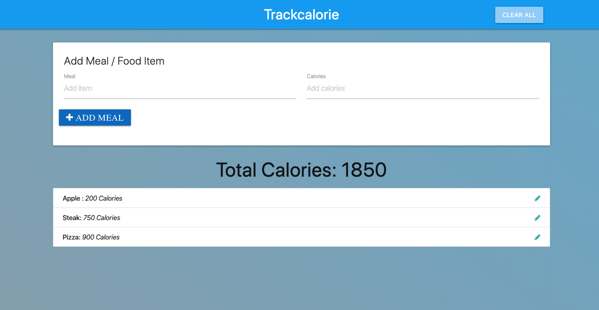
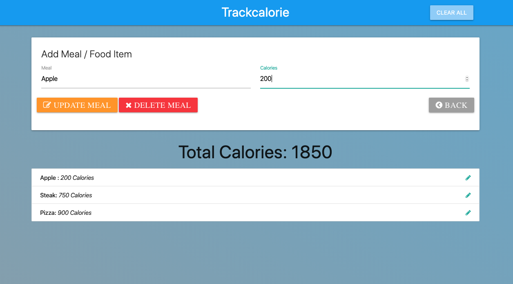

## TRACKcalorie

A vanilla JavaScript app built using the module pattern. 
- as a user I have the ability to add a meal and the number of calories coresponding to that meal
- the meals will add into a list and the total number of calories will be shown
- each individual item can be edited or deleted from the list
- we can also clear the list entierly
- the items persit in local storage

--------------------------------------------------------------------

